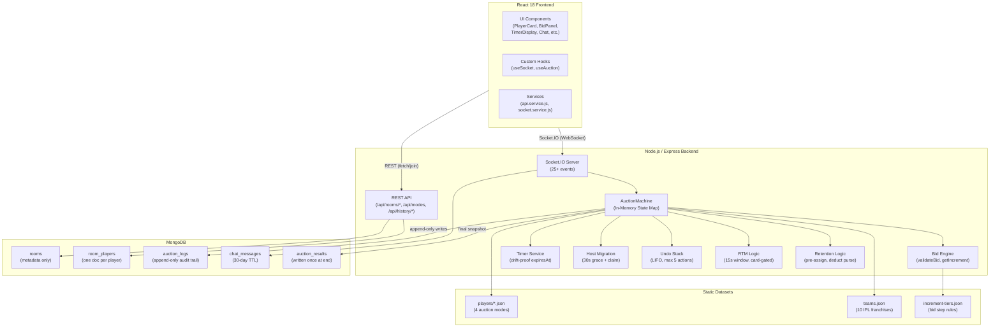
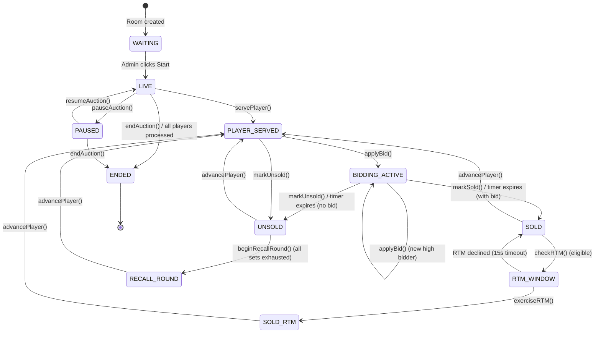
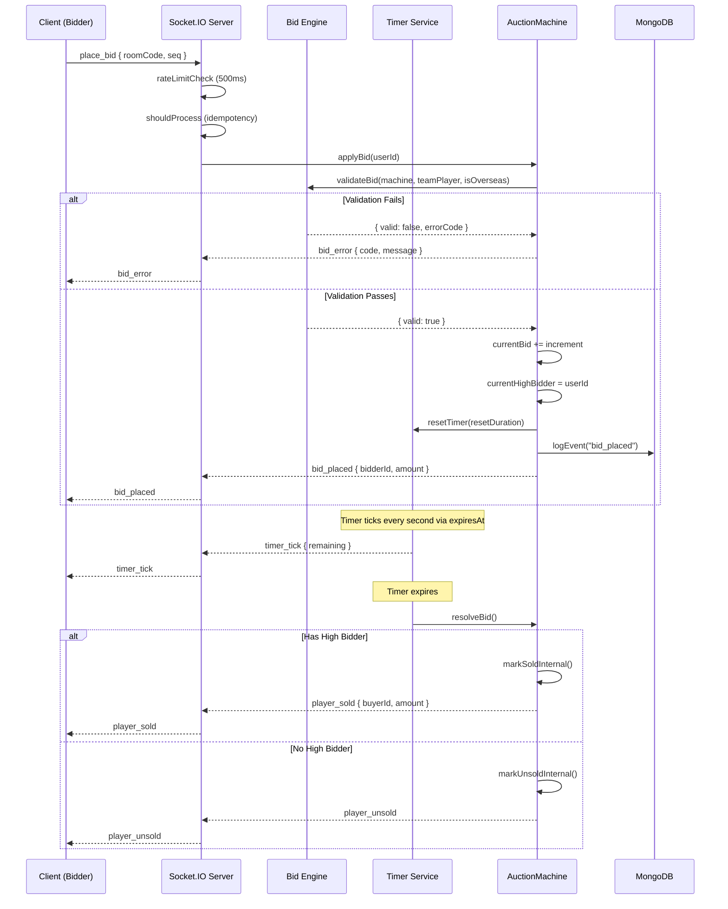
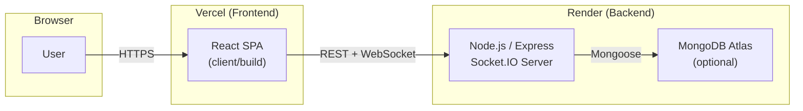

# IPL Auction — Real-Time Multiplayer Auction Engine

[](https://github.com/rahulcvwebsitehosting/IPLAuction/releases)
[](https://github.com/rahulcvwebsitehosting/IPLAuction/actions)
[](LICENSE)
[](CONTRIBUTING.md)

> **Built with passion, released as open-source.**  
> A complete, server-authoritative, room-based IPL auction simulator — designed for friends who love cricket, built for developers who value clean architecture.

---

## About

IPL Auction is a real-time multiplayer auction engine that lets you and your friends experience the IPL mega auction from your browser. Every bid is validated server-side, timers are drift-proof, and the entire state machine — recall rounds, RTM, retention, undo — runs on the backend. The frontend is a thin rendering layer that never decides a bid's validity.

This project was **painstakingly engineered over hundreds of hours** — from the state machine design to the MongoDB schema, from the socket event catalog to the four curated player datasets. It is released open-source so that every cricket-loving developer can run their own auction, learn from the architecture, and contribute back.

---

## Creator

**Rahul Shyam** — Full-stack developer, cricket enthusiast, open-source advocate.

[](https://www.linkedin.com/in/rahulshyamcivil/)
[](https://x.com/RahulShyamCv)
[](https://threads.com/@RahulCvJPS)

---

## Architecture

### High-Level System Design



### Auction State Machine



### Data Flow: Bid Lifecycle



---

## Tech Stack

### Backend

| Layer     | Technology                           |
| --------- | ------------------------------------ |
| Runtime   | Node.js 24.x                         |
| Framework | Express 4.17                         |
| Real-Time | Socket.IO 4.1.2                      |
| Database  | MongoDB 6.x (Mongoose)               |
| Auth      | Client-side (localStorage + SHA-256) |
| Testing   | Jest                                 |

### Frontend

| Layer     | Technology                                   |
| --------- | -------------------------------------------- |
| Framework | React 18                                     |
| Routing   | React Router 5.2                             |
| State     | useReducer (20-action auction state machine) |
| Real-Time | socket.io-client 4.1.2                       |
| Styling   | Sass (SCSS)                                  |
| HTTP      | Axios 0.21                                   |
| Build     | Create React App 4                           |

### Player Datasets

| Mode                  | Players | Features                          |
| --------------------- | ------- | --------------------------------- |
| IPL 2026 Mock Auction | 200     | Retentions, RTM, 42 sets          |
| IPL Legends Upgraded  | 248     | 26 sets (Marquee to Spinners)     |
| IPL Legends Top 100   | 100     | Top batters & bowlers (2008-2025) |
| Mega Auction          | 230+    | Clean slate, full 120 Cr budget   |

---

## Features

- **Server-Authoritative Bidding** — The frontend never decides bid validity. Every bid is validated server-side against purse, squad size, overseas limit, self-bid rules, and timer state.
- **Drift-Proof Timer** — Uses `expiresAt` timestamps rather than `remaining--`, preventing clock drift from corrupting auction timing.
- **Recall Rounds** — Up to 3 recall rounds with descending price multipliers (1.0x, 0.75x, 0.50x, 0.25x), floor of INR 10 Lakh.
- **RTM (Right to Match)** — In `mock_2026` mode, the retained team gets a 15-second window to match the winning bid.
- **Retention Logic** — Pre-assigns retained players to teams, deducts their cost from the purse, and removes them from the auction pool.
- **Undo Stack** — LIFO undo (max 5 actions) for admin error recovery.
- **Host Migration** — 30-second grace period after admin disconnect; any remaining player can claim host.
- **Idempotent Events** — Client-side monotonic seq counter prevents duplicate bid/chat processing.
- **Rate Limiting** — 500ms between bids, 200ms between chat messages per socket.
- **Append-Only Audit Log** — Every state change is written to `auction_logs` (never updated, only inserted). The auction machine can be reconstructed from logs on restart.
- **4 Auction Modes** — Each with a curated dataset, configurable settings (timer, squad size, overseas limit, RTM cards, recall rounds, auto-advance).
- **Chat** — Per-room chat with 500-char limit, HTML sanitization, 30-day TTL in MongoDB.

---

## Project Structure

```
├── app.js                          # Express + Socket.IO server entry
├── config/
│   └── constants.js                # Enums, defaults, tiers, mode configs
├── controller/
│   ├── auction.service.js          # AuctionMachine orchestrator (736 lines)
│   ├── bid.engine.js               # Tiered increment + bid validation
│   ├── host.migration.js           # Graceful admin failover
│   ├── retention.logic.js          # Pre-auction retention processing
│   ├── timer.service.js            # Server-authoritative countdown
│   └── undo.stack.js               # Bounded LIFO undo (max 5)
├── data/
│   ├── players/                    # 4 JSON player datasets
│   ├── teams.json                  # 10 IPL franchise definitions
│   └── increment-tiers.json        # Bid increment rules
├── database/
│   ├── connection.js               # Mongoose connection
│   └── models/                     # 5 Mongoose schemas
├── routes/
│   ├── socket.route.js             # 25+ socket event handlers
│   ├── room.route.js               # REST: create, join, validate, modes
│   └── history.route.js            # REST: export, user history
├── utilities/
│   ├── currency.js                 # Lakh ↔ Crore normalizer
│   ├── generateCode.js             # 6-char uppercase room codes
│   └── idempotency.js              # Socket sequence tracker
├── tests/
│   ├── bid.engine.test.js          # 14 unit tests (all validation paths)
│   └── currency.test.js            # 6 unit tests (conversion + format)
├── client/
│   ├── src/
│   │   ├── components/             # 14 UI components
│   │   ├── hooks/                  # useSocket, useAuction, UserContext
│   │   ├── pages/                  # Home, CreateRoom, RoomPage, etc.
│   │   ├── services/               # api.service.js, socket.service.js
│   │   ├── sass/                   # SCSS stylesheets
│   │   └── utilities/              # Axios instance, validation
│   ├── public/
│   └── package.json
├── PLAN.md                          # Full engineering specification (1516 lines)
└── README.md                        # This file
```

---

## How to Use (Beginner Guide)

### Prerequisites

- **Node.js** 18+ (v24 recommended)
- **npm** 9+
- **MongoDB** — local installation or [MongoDB Atlas](https://www.mongodb.com/atlas) free tier (optional: the app can run without it for basic functionality)

### Quick Start (5 minutes)

```bash
# 1. Clone the repository
git clone https://github.com/rahulcvwebsitehosting/IPLAuction.git
cd IPLAuction

# 2. Install backend dependencies
npm install

# 3. Install frontend dependencies
cd client
npm install --legacy-peer-deps
cd ..

# 4. Start both servers concurrently
npm run dev
```

This starts:

- **Backend** at `http://localhost:8000` (Express + Socket.IO)
- **Frontend** at `http://localhost:3000` (React dev server with hot reload)

Open `http://localhost:3000` in your browser.

### Step-by-Step Walkthrough

#### 1. Create an Account

- Click **Sign Up** in the top-right corner.
- Enter a username, email, and password.
- Accounts are stored in your browser (localStorage). Returning users are recognised automatically.

#### 2. Create a Room

- Click **Auction** in the navbar, or click **Create Room** on the homepage.
- **Select a mode**: IPL 2026 Mock Auction (retentions + RTM), Legends Upgraded (26 sets), Legends Top 100, or Mega Auction.
- **Pick your team**: Choose from 10 IPL franchises (CSK, DC, GT, KKR, LSG, MI, PBKS, RR, RCB, SRH).
- Click **Create Room**. A unique 6-character room code is generated (e.g. `XK4M9P`).

#### 3. Invite Friends

- Share the room code with friends.
- Friends go to `http://localhost:3000`, create an account, enter the room code on the homepage, select an untaken team, and click **Join Room**.

#### 4. Start the Auction

- Only the room creator (admin) can start the auction.
- In the lobby, click **Start Auction**.

#### 5. Bidding

- When a player is served, all participants see their name, role, nationality, base price, and a countdown timer.
- Click **Bid** to place a bid. The bid amount is automatically calculated using tiered increments:
  - ₹5L up to ₹20L
  - ₹5L from ₹20L to ₹75L
  - ₹10L from ₹75L to ₹1Cr
  - ₹25L from ₹1Cr to ₹2Cr
  - ₹50L beyond ₹2Cr
- The timer resets after each bid (configurable, default +5s, max 20s).
- If the timer expires with an active high bidder, the player is sold automatically.
- If the timer expires with no bids, the player is marked unsold.

#### 6. Admin Controls

Only the room creator can:

- **Start / Pause / Resume** the auction
- **Mark Sold / Mark Unsold** (ends bidding immediately)
- **Advance** to the next player
- **Undo** the last action (max 5 undos)
- **Update Settings** (timer duration, squad size, overseas limit, RTM cards, recall rounds, auto-advance)
- **End Auction** (writes final results to MongoDB)

#### 7. Recall Rounds

When all players in all sets have been auctioned, unsold players enter recall rounds. Each round applies a lower price multiplier (0.75x, 0.50x, 0.25x). The admin advances through recall rounds manually.

#### 8. RTM (Right to Match)

In `mock_2026` mode, when a retained player is sold to a different team, the original retaining team gets a 15-second RTM window. If they have RTM cards and sufficient purse, they can match the bid and acquire the player.

#### 9. Auction End

Once all players are sold or permanently unsold, or the admin clicks **End Auction**, results are persisted to MongoDB and broadcast to all clients.

### Running in Production

See the [deployment guide](#deployment) below.

---

## API Reference

### REST Endpoints

| Method | Path                             | Description                   |
| ------ | -------------------------------- | ----------------------------- |
| POST   | `/api/rooms/create`              | Create a new auction room     |
| GET    | `/api/rooms/:code`               | Get room details + players    |
| POST   | `/api/rooms/:code/join`          | Join a room with a team       |
| GET    | `/api/rooms/:code/validate-team` | Check if a team is available  |
| GET    | `/api/modes`                     | List available auction modes  |
| GET    | `/api/history/:username`         | Get user's auction history    |
| GET    | `/api/rooms/:code/export`        | Export results as JSON or CSV |

### Socket Events

#### Client → Server (18 events)

| Event             | Payload                      | Auth  | Description                        |
| ----------------- | ---------------------------- | ----- | ---------------------------------- |
| `create_room`     | `{ mode, team, userId }`     | —     | Create room (deprecated; use REST) |
| `join_room`       | `{ roomCode, team, userId }` | —     | Join a room                        |
| `leave_room`      | `{ roomCode }`               | —     | Leave a room                       |
| `start_auction`   | `{ roomCode }`               | Admin | Start the auction                  |
| `place_bid`       | `{ roomCode }`               | —     | Place next increment bid           |
| `advance_player`  | `{ roomCode }`               | Admin | Skip to next player                |
| `mark_sold`       | `{ roomCode }`               | Admin | Force-sell current player          |
| `mark_unsold`     | `{ roomCode }`               | Admin | Mark player unsold                 |
| `undo`            | `{ roomCode }`               | Admin | Undo last action                   |
| `exercise_rtm`    | `{ roomCode }`               | —     | Exercise Right to Match            |
| `pause_auction`   | `{ roomCode }`               | Admin | Pause the auction                  |
| `resume_auction`  | `{ roomCode }`               | Admin | Resume the auction                 |
| `update_settings` | `{ roomCode, settings }`     | Admin | Update auction settings            |
| `chat_message`    | `{ roomCode, message }`      | —     | Send a chat message                |
| `claim_host`      | `{ roomCode }`               | —     | Claim admin after disconnect       |
| `fetch_state`     | `{ roomCode }`               | —     | Request full state snapshot        |
| `end_auction`     | `{ roomCode }`               | Admin | End the auction                    |

#### Server → Client (22 events)

| Event                  | Payload                                                  | Description                         |
| ---------------------- | -------------------------------------------------------- | ----------------------------------- |
| `full_state`           | `{ room, players, isAdmin, auctionState, chatMessages }` | Complete state snapshot             |
| `join_result`          | `{ success, roomCode?, error? }`                         | Join attempt result                 |
| `player_joined`        | `{ players }`                                            | New player joined lobby             |
| `player_left`          | `{ userId }`                                             | Player left lobby                   |
| `auction_started`      | `{ mode, settings, totalPlayers }`                       | Auction has begun                   |
| `player_served`        | `{ player, basePrice, round, timer }`                    | New player up for auction           |
| `bid_placed`           | `{ bidderId, amount, newTimer }`                         | A bid was placed                    |
| `bid_error`            | `{ message, code }`                                      | Bid was rejected                    |
| `timer_tick`           | `{ remaining }`                                          | Timer countdown update              |
| `player_sold`          | `{ playerId, buyerId, buyerTeam, amount, rtm? }`         | Player was sold                     |
| `player_unsold`        | `{ playerId, reason }`                                   | Player went unsold                  |
| `budget_updated`       | `{ players }`                                            | Team budgets changed                |
| `recall_round_started` | `{ round, basePriceMultiplier, playerCount }`            | Recall round began                  |
| `rtm_window`           | `{ playerId, matchedTeam, amount, windowSeconds }`       | RTM window opened                   |
| `rtm_exercised`        | `{ playerId, teamId, amount }`                           | RTM was exercised                   |
| `rtm_declined`         | `{ playerId, teamId }`                                   | RTM window expired                  |
| `state_reverted`       | `{ snapshot }`                                           | Undo was performed                  |
| `auction_paused`       | `{ remaining }`                                          | Auction was paused                  |
| `auction_resumed`      | `{ remaining }`                                          | Auction was resumed                 |
| `auction_ended`        | `{ summary }`                                            | Auction has ended                   |
| `settings_updated`     | `{ settings }`                                           | Settings were changed               |
| `host_migration_vote`  | `{ message }`                                            | Admin disconnected; claim available |

---

## Configuration

### Environment Variables

| Variable         | Default                      | Description            |
| ---------------- | ---------------------------- | ---------------------- |
| `PORT`           | `8000`                       | Backend server port    |
| `CLIENT_URL`     | `http://localhost:3000`      | Allowed CORS origin    |
| `NODE_ENV`       | `development`                | Environment mode       |
| `DEV_MONGO_URL`  | `mongodb://localhost:27017/` | Local MongoDB URI      |
| `PROD_MONGO_URL` | —                            | Production MongoDB URI |
| `SECRET`         | —                            | JWT secret (legacy)    |

### Auction Settings (configurable per room)

| Setting           | Default  | Description                          |
| ----------------- | -------- | ------------------------------------ |
| `timerDuration`   | 10s      | Initial countdown per player         |
| `timerReset`      | 5s       | Extra time added after each bid      |
| `maxDuration`     | 20s      | Maximum allowed countdown            |
| `maxSquadSize`    | 25       | Maximum players per team             |
| `minSquadSize`    | 18       | Minimum players per team             |
| `overseasLimit`   | 8        | Maximum overseas players             |
| `basePurse`       | 12000 Cr | Starting purse (in lakhs)            |
| `rtmCards`        | 3        | RTM cards per team (mock_2026 only)  |
| `maxRecallRounds` | 3        | Maximum recall rounds                |
| `autoAdvance`     | false    | Auto-advance to next player after 3s |

---

## Testing

```bash
# Run all backend tests
npm test

# Run tests with coverage
npx jest --coverage
```

### Test Coverage

- **Bid Engine** (14 tests): All increment tiers, all 7 validation failure modes (player not open, timer expired, self-bid, insufficient funds, squad full, overseas full), boundary cases.
- **Currency Utilities** (6 tests): Lakh-to-crore conversion, crore-to-lakh conversion, display formatting.

---

## Deployment

### Split Deployment Architecture



The frontend (React SPA) deploys to **Vercel** for global CDN delivery. The backend (Node.js + Socket.IO) deploys to **Render** because it needs a long-lived process to maintain WebSocket connections and in-memory auction state.

### Step 1 — MongoDB Atlas (Optional)

1. Create a free account at [mongodb.com/atlas](https://www.mongodb.com/atlas).
2. Build a free M0 cluster.
3. Add a database user (username + password).
4. Under Network Access, allow `0.0.0.0/0`.
5. Click Connect → Drivers and copy the connection string — this is your `PROD_MONGO_URL`.

### Step 2 — Backend on Render

1. Push this repo to GitHub.
2. On [render.com](https://render.com): New → Blueprint, select this repo.
3. Set environment variables:
   - `CLIENT_URL` — your Vercel frontend URL (from Step 3)
   - `NODE_ENV` — `production`
   - `PROD_MONGO_URL` — optional (from Step 1)
4. Deploy. Note the URL (e.g. `https://ipl-auction.onrender.com`).

### Step 3 — Frontend on Vercel

1. On [vercel.com](https://vercel.com): Add New → Project, import this repo.
2. Set Root Directory to `client`.
3. Add environment variable:
   - `REACT_APP_API_URL` — your Render backend URL (e.g. `https://ipl-auction.onrender.com`)
4. Deploy.
5. Update Render's `CLIENT_URL` to your Vercel URL, then redeploy the backend.

---

## Project Status

This project is **actively maintained**. The core auction engine is complete and production-ready. Planned enhancements:

- Redis-backed distributed state (horizontal scaling)
- Socket.IO integration tests with reconnection scenarios
- Timer service unit tests
- Admin dashboard with real-time metrics
- Mobile-responsive UI refinements
- Dark mode

---

## License

This project is open-source under the [ISC License](LICENSE).

---

## Acknowledgments

Built with love for the cricket community. If you find this project useful, please ⭐ star the repository — it means a lot.

For questions, feature requests, or contributions, reach out to Rahul Shyam:

[](https://www.linkedin.com/in/rahulshyamcivil/)
[](https://x.com/RahulShyamCv)
[](https://threads.com/@RahulCvJPS)
